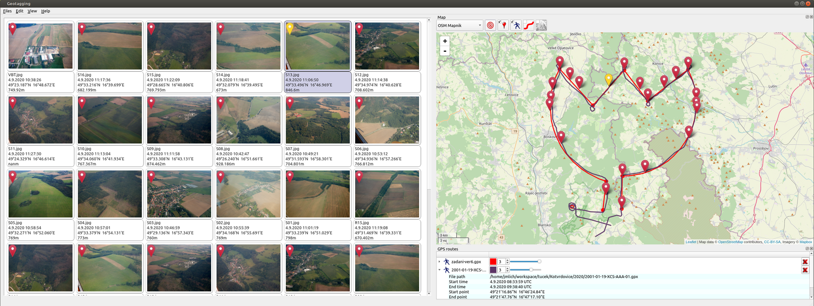

# Introduction

Geotagging is rather simple tool for manipulating with geographical information stored in JPEG images (in EXIF section). Your photos can be augmented by GPS coordinates by synchronization from track log files (*.gpx). The GPS coordinates can be also adjusted manually using Drag and Drop.

# Installation

* Windows - download exe file from [https://github.com/jmlich/geotagging/releases](releases section)
* Fedora - add COPR repository and install rpms
* Other Linux distributions - use flatpak

# Contribute

* Translate to your language at [transifex](https://www.transifex.com/jozef-mlich/geotagging/dashboard/).
* Feel free to open issue
* Feel free to create merge request 

# Screenshots

# Video tutorial

www.fit.vutbr.cz/study/DP/BP.php.cs?id=11578
